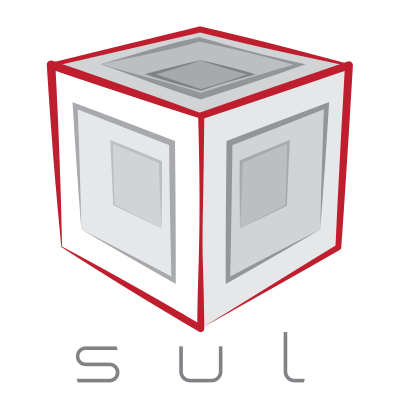

# sul

*An WIP OpenAPI Rust Tower Service generator*

 

Generating Rust code for a Contract-First OpenAPI approach.

The example project is an already running example and this is just where it starts.

## Example

Given an OpenAPI spec:

```yaml
openapi: 3.0.0
# omitted
paths:
  /users/{id}:
    get:
      summary: Returns a user by id.
      description: Some text
      responses:
        '200':
          description: Some text
          content:
            application/json:
              schema:
                type: string
      parameters:
        - name: id
          in: path
          required: true
```

I want to implement an HTTP server according to a contract without writing boilerplate code 

```rust
#[sul::openapi("openapi.yaml")]
pub struct ApiController {
    context: Context,
}

impl ApiController {
    pub fn new(context: Context) -> ApiController {
        ApiController { context }
    }

    pub async fn get_users_id_(self, request: GetUsersIdRequest) -> GetUsersIdResponse {
        GetUsersIdResponse::ok(&format!("parameter is {}", request.id))
    }
}
```

so that I can concentrate on my real problems.
